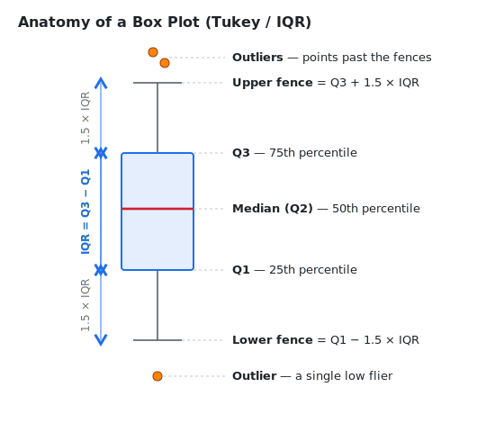

# Project 2 — Summary Statistics & Outlier Detection

A step up from Project 1. Instead of just *reading* a dataset, you'll
**describe** it with statistics and then hunt for **outliers** — the data
points that don't fit the pattern. Along the way you'll discover two things:

1. The humble box plot you get "for free" from matplotlib is really just a
   *picture* of statistics you can compute by hand.
2. Your first, obvious attempt at finding outliers will find **none** — and
   figuring out *why* is the real lesson of this project.

> **The big idea:** statistics and visualization aren't two separate things. A
> box plot is a statistical calculation that happens to be drawn instead of
> printed. This project shows that the picture *is* the analysis, and that good analysis
> means understanding the *structure* of your data, not just running a formula
> over a column.

## The dataset: Palmer Penguins

[Palmer Penguins](https://allisonhorst.github.io/palmerpenguins/) is a dataset
of **344 penguins** from three species (Adélie, Chinstrap, Gentoo) measured on
three islands in Antarctica. It's the modern, friendlier replacement for the
old "Iris" dataset that every stats course used to use.

The numeric columns are the interesting ones:

| Column | Meaning |
|---|---|
| `bill_length_mm` | length of the bill (beak) |
| `bill_depth_mm` | depth/thickness of the bill |
| `flipper_length_mm` | flipper length |
| `body_mass_g` | body mass in grams |

It also has `species`, `island`, and `sex`, plus a **few missing values** and —
as you'll discover — outliers that **only show up when you look at the data the
right way**. Clean data is boring; this data has just enough structure to make
the analysis genuinely interesting.

## 1. Pull the data

Unlike Project 1 (where you downloaded a CSV by hand from Kaggle), this project
includes a script that fetches the data for you. From the repo root:

```bash
uv run python project_2/data/pull_data.py
```

That downloads `penguins.csv` into `project_2/data/`. You should see:

```
Loaded OK: 344 rows x 7 columns
Columns: species, island, bill_length_mm, bill_depth_mm, flipper_length_mm, body_mass_g, sex
```

> **Don't commit the data.** The CSV is generated, so it stays out of git. The
> repo's `.gitignore` already ignores `project_2/data/*.csv` — but note it
> keeps `pull_data.py` tracked, since that's *code*, not data. Anyone who
> clones the repo just re-runs the script.


## 2. Compute summary statistics

Start by loading the data and getting a feel for it. Create
`project_2/analysis.py` and work from there:

```python
import pandas as pd

df = pd.read_csv("data/penguins.csv")   # run from inside project_2/

print(df.shape)
print(df.describe())        # count, mean, std, min, 25%, 50%, 75%, max
print(df.isna().sum())      # how many missing values per column?
```

`df.describe()` already hands you most of what you need. Look at the `25%`,
`50%` (the median), and `75%` rows — those are the **quartiles**, and they're
the raw material for finding outliers.

**Your task:** for each numeric column, compute and print:

- the **mean** and **median** (and notice when they disagree — that's a hint
  the data is skewed),
- the **standard deviation**,
- the **min** and **max**,
- the three **quartiles** Q1, Q2 (median), and Q3.

```python
col = df["body_mass_g"]
q1 = col.quantile(0.25)
q2 = col.quantile(0.50)   # same as col.median()
q3 = col.quantile(0.75)
```

## 3. The Tukey / IQR method — what a box plot actually computes

Here's the method, invented by statistician **John Tukey** (the same person who
coined the word "software"). It's the rule matplotlib uses by default when it
draws a box plot, and it's the heart of this project.

**Step 1 — the IQR.** The *Interquartile Range* is just the width of the middle
50% of the data:

```
IQR = Q3 - Q1
```

**Step 2 — the fences.** Walk out `1.5 × IQR` past each end of the box. Anything
past those lines is considered an outlier:

```
lower_fence = Q1 - 1.5 * IQR
upper_fence = Q3 + 1.5 * IQR
```

**Step 3 — flag the outliers.** Any data point below the lower fence or above
the upper fence is an outlier:

```python
iqr = q3 - q1
lower = q1 - 1.5 * iqr
upper = q3 + 1.5 * iqr

outliers = df[(df["body_mass_g"] < lower) | (df["body_mass_g"] > upper)]
print(outliers)
```

Why `1.5`? It's Tukey's rule of thumb — wide enough that normal, well-behaved
data almost never trips it, but tight enough to catch genuinely unusual points.
(Some people use `3.0 × IQR` for "extreme" or "far out" outliers. Try both and
see what changes.)

### Connect it to the picture

<p align="center">
  
</p>

When matplotlib draws a box plot:

- the **box** spans Q1 to Q3 (that's the IQR),
- the **line inside the box** is the median (Q2),
- the **whiskers** reach out to the most extreme point still *inside* the
  fences,
- the **dots beyond the whiskers** ("fliers") are exactly the outliers the IQR
  rule flags.

Both pandas' `.quantile()` and matplotlib's box plot use the same (linear)
method for quartiles, so they agree exactly: the rows your code flags are the
same dots matplotlib draws. That's the first payoff — the "visualization" was a
statistics calculation all along.

## 4. The twist: run it on the whole dataset and you'll find *nothing*

Here's the surprise. Run your Step-3 code on `body_mass_g` for all 344
penguins... and it flags **zero outliers**. Same for every other numeric
column:

```
bill_length_mm      0 outliers
bill_depth_mm       0 outliers
flipper_length_mm   0 outliers
body_mass_g         0 outliers
```

Your code isn't broken. This is a real data-analysis insight, and it's the most
important thing in this project:

> **You mixed three different species together.** Gentoo penguins are *much*
> bigger than Adélies. Throwing all three into one column makes the spread
> enormous — the IQR balloons, the fences fly way out, and nothing can escape
> them. The unusual penguins are still there; they're just hidden inside a
> blurry average of three different animals.

The fix is to analyze **within each group**. Use `groupby` and apply your
outlier function per species:

```python
for species, group in df.groupby("species"):
    out = find_outliers(group["body_mass_g"])   # your function from Section 5
    print(species, "body-mass outliers:", len(out))
```

Now the hidden penguins appear. With the 1.5×IQR rule you should find, for example:

| Column | Adélie | Chinstrap | Gentoo |
|---|---|---|---|
| `bill_depth_mm` | 1 | 0 | 0 |
| `flipper_length_mm` | 2 | 0 | 0 |
| `body_mass_g` | 0 | 2 | 0 |
| `bill_length_mm` | 0 | 0 | 1 |

And the box plot shows it too — draw one box *per species* and the fliers pop
right out:

```python
import matplotlib.pyplot as plt

df.boxplot(column="body_mass_g", by="species")
plt.show()   # the dots over the Chinstrap box are your 2 outliers
```

**This is the lesson:** an outlier is only "out" relative to the right
comparison group. Statistics applied blindly to mixed-up data hides exactly
what you're looking for. Knowing *how to slice the data* matters more than
knowing the formula.

## 5. The assignment

Write `project_2/analysis.py` so that it:

1. Loads `data/penguins.csv`.
2. Prints summary statistics for every numeric column (Section 2).
3. Implements the Tukey/IQR method **as a reusable function**, e.g.:

   ```python
   def find_outliers(series):
       """Return the values in `series` that fall outside the 1.5*IQR fences.

       Ignores missing values (NaN) rather than counting them as outliers.
       """
       ...
   ```

4. Runs `find_outliers` on each numeric column for the **whole dataset** and
   reports the counts (you'll see the zeros — keep them in your output, they're
   part of the story).
5. Runs it **per species** with `groupby` and reports which penguins are
   outliers within their own species.
6. Draws a box plot grouped by species for at least one column and confirms by
   eye that the fliers match your function's output.

## 6. Stretch goals (optional, but this is where it gets interesting)

- **Compare methods.** The other classic outlier rule is the **z-score**: flag
  points more than 3 standard deviations from the mean. Implement it and see
  where it agrees and disagrees with the IQR method. (Hint: z-score assumes the
  data is bell-shaped; IQR doesn't. Which is more trustworthy on skewed data?)
- **Go further with the grouping.** Does splitting by `sex` *and* `species`
  reveal or remove outliers? Male and female penguins differ in size too.
- **Handle the missing values** deliberately — make sure `find_outliers`
  ignores `NaN` rather than crashing or counting it.
- Save a `data/penguin_outliers.csv` with just the flagged rows (it'll be
  ignored by git, same as the source CSV).

## What you'll have learned

- How to summarize a dataset with quartiles, IQR, mean, and standard deviation.
- The Tukey method for outlier detection, implemented from scratch.
- That a box plot is a *visualization of statistics you can compute yourself*.
- The real lesson: **outliers are relative to a group.** Good analysis starts
  with understanding the structure of your data, not with running a formula.
