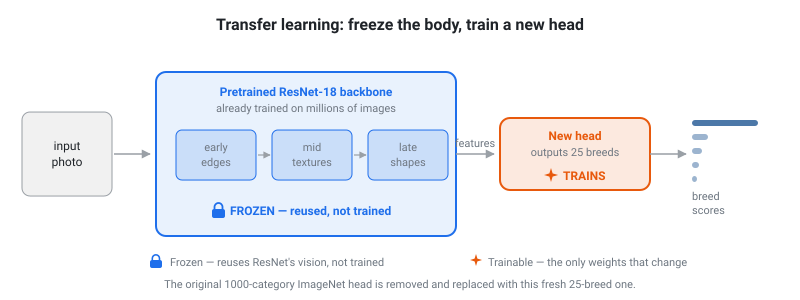
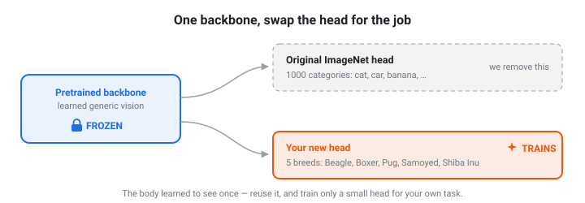

# Project 6 — Dog Breed Image Classifier (CNN + Transfer Learning)

This is the project that cashes in Project 5's promise. Remember the honest
lesson there: on small *tabular* data, trees tie or beat neural nets — deep
learning's real edge is **big, unstructured data**. Dog photos are exactly that,
and here a neural net isn't just better, it's the *only* sensible tool. You'll
build a model that looks at a photo and names the breed.

The catch: training an image model *from scratch* needs millions of images and a
datacenter. So we do what real practitioners do — **transfer learning**.

## The big idea: transfer learning

> Take a CNN already trained on millions of images (ImageNet). It *already* knows
> edges, fur, ears, snouts, shapes. **Freeze all of that, throw away only its
> final layer, and train a fresh final layer for our 25 dog breeds.**

<p align="center">
  
</p>

You reuse the pretrained network's "eyes" and only teach it the last step —
"given everything you already see, which of *these 25 breeds* is it?" That's why
this trains in a couple of minutes on a laptop instead of needing a server farm.

The backbone isn't special to dogs — it's a general-purpose *feature extractor*.
That's the whole reason freezing works: you keep the reusable vision and only
swap in a small head for your particular task.

<p align="center">
  
</p>

We'll use **ResNet18**, a well-known pretrained CNN that ships with torchvision.

## Our breeds: all 25 in the dataset

Oxford-IIIT Pet ships **25 dog breeds**, and we use all of them (see the `BREEDS`
list in `data_setup.py`). Some are unmistakable — a fluffy white Samoyed, a Pug —
but several are genuine look-alikes (an **American Pit Bull Terrier** vs. a
**Staffordshire Bull Terrier** are hard even for people). That mix is the point:
accuracy stays high but not perfect, and the confusion matrix gets genuinely
interesting.

> Want a near-perfect demo instead? Trim `BREEDS` down to a handful of visually
> distinct breeds and retrain — fewer, more separable classes score higher.

## 1. Pull the data & sync

```bash
uv sync                                    # torch + torchvision are in pyproject.toml
uv run python -c "import data_setup; data_setup.train_loader()"   # triggers the download
```

The first run downloads the Oxford-IIIT Pet dataset (~800 MB) into
`project_6/data/` (git-ignored), then keeps just the breeds in `BREEDS`. All the download +
filtering + image preprocessing lives in the provided **`data_setup.py`** — read
it, but you don't write it.

> **Run the scripts from inside `project_6/`** (they use relative paths and
> `import data_setup`).

## 2. Images as data, and why a CNN

A tabular row was a handful of numbers. An image is a **grid of pixels** — for us,
3 color channels × 224 × 224 ≈ 150,000 numbers per photo. You *could* flatten that
into a plain neural net (like Project 5's), but you'd throw away all the spatial
structure — that an ear is next to a head, that fur has texture.

A **CNN (convolutional neural network)** instead slides small filters across the
image looking for *local* patterns, and stacks them: edges → textures → parts →
whole dogs. That's why CNNs dominate images. The good news: ResNet already *is*
that CNN, fully trained — you just reuse it.

## 3. The provided plumbing

- **`data_setup.py`** — `train_loader()`, `test_loader()`, and `BREEDS`. It
  applies the *exact* preprocessing ResNet expects (resize → crop 224 →
  normalize), which is what lets us reuse the pretrained network.
- **`viz.py`** — `show_grid(images, titles)` to display dogs in a labeled grid
  (great for seeing mistakes).

You write three scripts — **`train_classifier.py`**, **`evaluate.py`**, and
**`predict.py`** — from the skeletons below.

## 4. Write `train_classifier.py`

Same scaffolding rule as Project 5: some of the structure is given, and each
`TODO` is yours. You'll build the transfer model in three small steps — **load** a
pretrained network, **freeze** it, **swap** its final layer — then **train** the
new head. (Most TODOs are only a line or two.)

```python
import torch
import torch.nn as nn
from torchvision.models import resnet18, ResNet18_Weights
import data_setup

# Apple Silicon GPU if available, else CPU (given).
device = "mps" if torch.backends.mps.is_available() else "cpu"
print("training on:", device)

train_loader = data_setup.train_loader()
num_classes = len(data_setup.BREEDS)          # 25 (however many you listed)

# ===== TODO 1: load the pretrained network =====
# ResNet18, already trained on ImageNet — it arrives knowing how to "see".
#     model = resnet18(weights=ResNet18_Weights.DEFAULT)
model = ...

# ===== TODO 2: freeze the backbone =====
# `requires_grad = False` tells PyTorch NOT to compute gradients for these weights.
# No gradients means the optimizer can't nudge them — they're "frozen" and reused
# exactly as they came from ImageNet.
#     for p in model.parameters():
#         p.requires_grad = False

# ===== TODO 3: swap in a new head =====
# `fc` is ResNet's final "fully connected" layer — the classifier that sits on top
# of the features (a plain `nn.Linear`). The pretrained one has 1000 outputs
# (ImageNet's categories); replace it with a fresh Linear that outputs num_classes.
# A brand-new layer has requires_grad = True by default, so this head is the ONLY
# part that trains.
#     model.fc = nn.Linear(model.fc.in_features, num_classes)

model = model.to(device)

# Keep the frozen backbone in eval() mode while training, so its
# BatchNorm stays fixed on the pretrained stats. (See "Why eval()?" below.)
model.eval()

# ===== TODO 4: train the new head =====
# Same shape as Project 5's training loop, with three image tweaks:
#   - optimize ONLY the head:   opt = torch.optim.Adam(model.fc.parameters(), lr=1e-3)
#   - loss is nn.CrossEntropyLoss()   (multi-class)
#   - move each batch to the device:  xb, yb = xb.to(device), yb.to(device)
#   - 5 epochs is plenty; print the loss each epoch and watch it fall
#     (zero_grad -> forward -> loss -> backward -> step)

# ===== Save the trained model (given) =====
model.breeds = data_setup.BREEDS      # remember the class names WITH the model, so
#                                       predict.py and Project 7 never need their own copy
torch.save(model, "dog_model.pt")     # evaluate.py and Project 7 both load this
print("saved dog_model.pt")
```

> **Why `eval()` during training?** "Freezing" the backbone (the blue part of the
> diagrams above) means its weights don't change — and `eval()` extends that to its
> **BatchNorm** layers, keeping them on the pretrained ImageNet statistics instead
> of recomputing them from our few hundred images. It only touches BatchNorm/Dropout,
> not your head's learning. (Plain `train()` mode also works, ~1% lower here; `eval()`
> is the standard, slightly-steadier choice for a frozen feature extractor.)

Run it (from inside `project_6/`):

```bash
uv run python train_classifier.py
```

The loss should drop fast, and you'll get a **`dog_model.pt`** file — your trained
model, saved as an artifact. (Training is quick: only the tiny head is learning.)

## 5. Write `evaluate.py`

A separate script that **loads** the model you just saved and grades it on the
test set — the flip side of "a model is an artifact you reload."

```python
import torch
from sklearn.metrics import accuracy_score, confusion_matrix
import data_setup
import viz

device = "mps" if torch.backends.mps.is_available() else "cpu"
test_loader = data_setup.test_loader()
BREEDS = data_setup.BREEDS

# Load the model train_classifier.py saved (given).
model = torch.load("dog_model.pt", map_location=device, weights_only=False)
model.eval()

# ===== TODO 1: accuracy + confusion matrix =====
# Collect the model's guess for every test image, then score them. The new piece is
# `with torch.no_grad():` — a *context manager*. Everything you indent beneath the
# `with` line runs as one block with gradient tracking switched off (the callout
# below says why). Type it out and watch the indentation:
#
#     preds, trues = [], []
#     with torch.no_grad():                       # opens the "no-gradients" block
#         for images, labels in test_loader:      # indented -> runs inside the block
#             outputs = model(images.to(device))  # one score per breed, per image
#             preds += outputs.argmax(1).cpu().tolist()   # index of the top score
#             trues += labels.tolist()                    # the correct answers
#     # dedent back to here and the block is closed again
#
#     print("accuracy:", accuracy_score(trues, preds))
#     print(confusion_matrix(trues, preds))       # rows = true breed, cols = predicted

# ===== TODO 2: see what it got wrong (fun) =====
# Gather a few test images where prediction != true label and show them:
#     viz.show_grid(images, [f"pred: {BREEDS[p]} / true: {BREEDS[t]}" for ...])
```

> **What's `with torch.no_grad()`?** While training, PyTorch quietly records every
> operation so it can compute gradients for backprop. At evaluation you're only
> *predicting* — no learning happens — so all that bookkeeping is wasted effort.
> `with torch.no_grad():` switches gradient tracking off for everything inside the
> block: it uses less memory, runs a bit faster, and clearly signals "just run the
> model, don't train it."

Run it (from inside `project_6/`):

```bash
uv run python evaluate.py
```

**What you should see:** test accuracy around **~92%** across the 25 breeds — lower
than a 5-breed toy problem would give, and that's the honest reality of more (and
more similar) classes. The confusion matrix is now 25×25, too big to eyeball, but
its mistakes make sense: the single biggest one is **American Pit Bull Terrier ↔
Staffordshire Bull Terrier** — two breeds that genuinely look near-identical.
Distinct breeds (Samoyed, Pug) stay near-perfect. *That's* transfer learning being
realistic, not just easy.

### Reading the confusion matrix: accuracy, precision, recall

The confusion matrix is a grid — **rows are the true breed, columns are what the
model predicted.** The diagonal is correct; off-diagonal cells are mistakes, and
*which* cell tells you *which* breeds got confused. The full grid is 25×25, so
let's zoom in on the two look-alike terriers (their columns also collect stray
guesses from the other 23 breeds):

```
                       predicted →
                       Pit Bull   Staffie   (+23 others)
true  Pit Bull            52         33          15
      Staffordshire       15         57          17
```

Three scores, all read off the grid:

- **Accuracy** — overall fraction correct: the whole diagonal ÷ the total
  (**~92%** here). One number for the model. Handy, but it hides *which* breeds are
  weak.
- **Recall** (for one breed) — of all the *real* photos of that breed, how many did
  the model catch? Read **across its row**: `diagonal ÷ row total`. Pit Bull's
  recall is 52/100 = **52%** — it misses almost half, mostly calling them Staffies.
- **Precision** (for one breed) — when the model *says* a breed, how often is it
  right? Read **down its column** (all 25 true breeds feed it): `diagonal ÷ column
  total`. Staffie's precision is 57/105 = **54%** — lots of *other* dogs (pit bulls
  especially) get mislabeled Staffie.

See the pattern: that one clump of **33 pit-bulls-called-Staffie** shows up twice —
it *drops Pit Bull's recall* (they got missed) *and* *drops Staffie's precision* (it
over-claimed). A miss for one breed is a false alarm for another. Accuracy alone
would've hidden this; precision and recall pin it on the terriers.

> `sklearn` computes all of these at once — add
> `from sklearn.metrics import classification_report` and
> `print(classification_report(trues, preds, target_names=BREEDS))`.

## 6. Write `predict.py` — classify your own dog 🐕

The reward — and your third script. **`predict.py` is the close cousin of
`evaluate.py`:** both load the saved model and run images through it inside a
`torch.no_grad()` block. The difference is what they're *for*:

|                | `evaluate.py`                         | `predict.py`                          |
| -------------- | ------------------------------------- | ------------------------------------- |
| input          | the whole labeled **test set**        | **one new photo** you pass in         |
| ground truth   | yes — used to score accuracy          | none — it's brand-new data            |
| output         | accuracy + confusion matrix           | this photo's breed + probabilities    |

That second column is **inference**: running the model on real, unlabeled data one
example at a time. It's what actually happens in production — and it's exactly the
step Project 7 will wrap in a web page.

```python
import sys
import torch
from PIL import Image
from data_setup import BREEDS, TRANSFORM

path = sys.argv[1]     # the photo to classify: uv run python predict.py my_dog.jpg

# Load the saved model and switch to eval() — identical to evaluate.py (given).
model = torch.load("dog_model.pt", map_location="cpu", weights_only=False)
model.eval()

# ===== TODO 1: turn ONE image file into a model-ready batch =====
# evaluate.py got ready-made batches from the DataLoader. Here the "batch" is the
# single new photo you supply, so you build it yourself: open the file, apply the
# SAME preprocessing the model was trained with (TRANSFORM), then add a batch
# dimension of 1 so the shape matches what the model expects.
#     image = Image.open(path).convert("RGB")
#     x = TRANSFORM(image).unsqueeze(0)          # shape (1, 3, 224, 224): a batch of one

# ===== TODO 2: run inference and show every breed's probability =====
# Same no-gradients block as evaluate.py — you're predicting, not training. But
# evaluate.py only needed argmax (the single top guess) to score accuracy; here
# there's no answer key, so show the FULL distribution with softmax and rank it.
#     with torch.no_grad():
#         probs = torch.softmax(model(x), dim=1)[0]      # one probability per breed
#     ranked = sorted(zip(BREEDS, probs.tolist()), key=lambda t: t[1], reverse=True)
#     print(f"\nPrediction for {path}:")
#     for breed, p in ranked:
#         print(f"  {breed:10s} {p:6.1%}  {'#' * round(p * 30)}")
#     print(f"\n=> {ranked[0][0]}")
```

Run it (from inside `project_6/`):

```bash
uv run python predict.py path/to/your_dog.jpg
```

It should print a probability for *every* breed (all 25 now — here are the top few
for a clear Pug):

```
Pug                        99.9%  ##############################
Boxer                       0.0%
Staffordshire Bull Terrier  0.0%
Chihuahua                   0.0%
...  (21 more, all ~0%)
=> Pug
```

Point it at a photo of your own dog! It only *knows* these 25 breeds, so a dog
that's none of them gets sorted into the nearest look-alike — a French bulldog
will lean **Pug**, a husky will lean **Shiba Inu**. That "spread the probability
over similar breeds" behavior is exactly what Project 7 turns into a live chart.

## 7. The assignment

1. Complete **`train_classifier.py`** — the freeze + swap-the-final-layer step is
   the whole lesson; make sure you understand *why* only the new layer learns.
2. Complete **`evaluate.py`** — print the confusion matrix and **look at a grid of
   the dogs it got wrong**.
3. Complete **`predict.py`** and run it on a photo of your own dog (or any dog off
   the internet) — your first taste of model *inference* on brand-new data.

## 8. Stretch goals

- **Fewer or bigger.** We already use all 25 Oxford-Pet dog breeds. Trim `BREEDS`
  to a handful of distinct ones and watch accuracy jump — or, for a real challenge,
  step up to a bigger dataset (Stanford Dogs has 120 breeds).
- **Fine-tune, don't just freeze.** Unfreeze the last block of the ResNet (set
  `requires_grad = True` on `model.layer4`) and train with a small learning rate.
  Does it help on so few images, or overfit?
- **Data augmentation.** Swap in random flips/crops for the training transform —
  more variety from the same photos.
- **Confidence.** Print the model's probability for each prediction; find the dogs
  it was *least* sure about and see if they're genuinely ambiguous.

## What you'll have learned

- What a **CNN** is and why it beats a plain net on images.
- **Transfer learning** — freeze a pretrained network, retrain only the final
  layer — and why that's how image classification is really done.
- Training with **DataLoaders**, batches, and the **Apple Silicon GPU (MPS)**.
- A couple of practical details: running a frozen backbone in **`eval()` mode** so
  its BatchNorm uses pretrained statistics, and that a **saved model is an
  artifact** you reload later (here, for Project 7).
